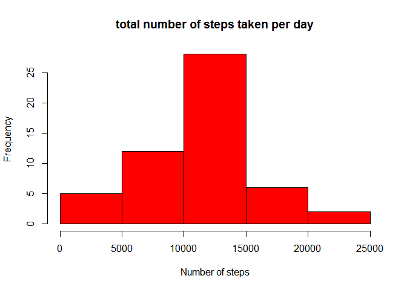
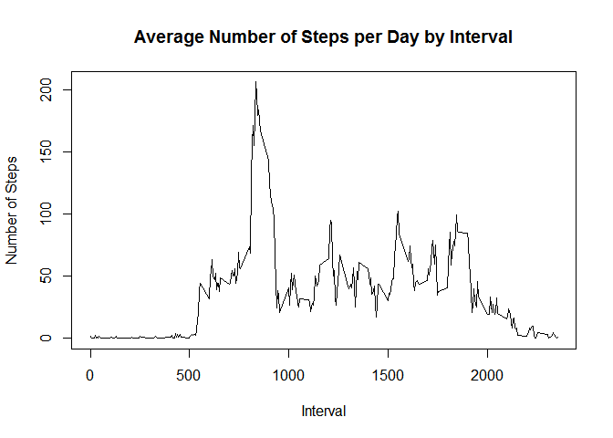
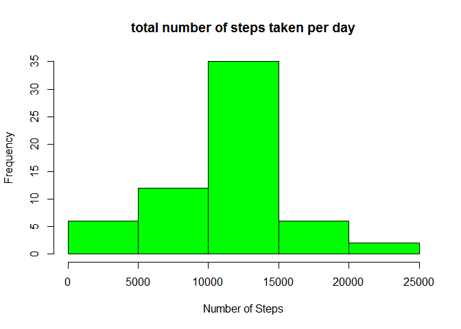
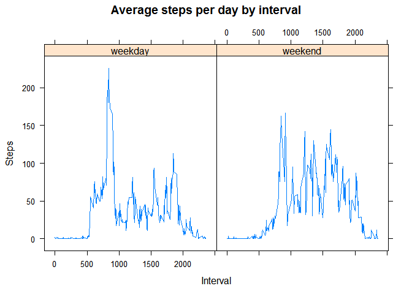

# Reproducible Research: Peer Assessment 1


## Loading and preprocessing the data
* Download, unzip and load data into the data frame object `data`. 

```r
sourcefile <- "https://d396qusza40orc.cloudfront.net/repdata%2Fdata%2Factivity.zip"  
destfile <- "activity.zip"
if(!file.exists(destfile)) { 
  download.file(sourcefile, destfile=destfile, quiet=TRUE) 
}
unzip(destfile)
data <- read.csv("activity.csv")
```


## What is mean total number of steps taken per day?
* Sum steps by day 

```r
steps_by_day <- aggregate(steps ~ date, data, sum)
```

* Create histogram

```r
hist(steps_by_day$steps, main = paste("total number of steps taken per day"), col="red", xlab="Number of steps")
```



* Compute mean and median.

```r
mean_steps <- mean(steps_by_day$steps)
median_steps <- median(steps_by_day$steps)
```

The `mean` is 1.0766189\times 10^{4} and the `median` is 10765.


## What is the average daily activity pattern?

* Calculate average steps for each interval for all days. 

```r
steps_by_interval <- aggregate(steps ~ interval, data, mean)
```

* Plot the Average Number Steps per Day by Interval. 

```r
with(steps_by_interval, plot(interval,steps, type="l", xlab="Interval", ylab="Number of Steps",main="Average Number of Steps per Day by Interval"))
```



* Find interval with most average steps. 

```r
max_interval <- steps_by_interval[which.max(steps_by_interval$steps),1]
```

835 is the 5-minute interval, on average across all the days in the dataset, which contains the maximum number of steps.


## Imputing missing values

```r
incomplete <- sum(!complete.cases(data))
```

2304 values are missing  in the dataset (i.e. total number of rows with NAs)

We decided to replace missing values with the average for each interval. A special correction (0) is applied for 10-01-2012 because this is the first day. The result is put into a new dataset `corrected_data`.

```r
corrected_data <- transform(data, steps = ifelse(is.na(data$steps), steps_by_interval$steps[match(data$interval, steps_by_interval$interval)], data$steps))
corrected_data[as.character(corrected_data$date) == "2012-10-01", 1] <- 0
```

* Recount total steps by day and create a new histogram (same as above).

```r
steps_by_day_new <- aggregate(steps ~ date, corrected_data, sum)
hist(steps_by_day_new$steps, main = paste("total number of steps taken per day"), col="green", xlab="Number of Steps")
```



* Compute new mean and median for the corrected data. 

```r
mean_steps_new <- mean(steps_by_day_new$steps)
median_steps_new <- median(steps_by_day_new$steps)
```

* Compute difference between corrected and original data.

```r
delta_mean <- mean_steps_new - mean_steps
delta_median <- median_steps_new - median_steps
```

* Compute the difference of steps by day

```r
total_diff <- sum(steps_by_day_new$steps) - sum(steps_by_day$steps)
```
* The mean total number of steps taken by day is 1.0589694\times 10^{4}
* The median total number of steps taken by day is  1.0766189\times 10^{4}

These values differ from the estimates of the first part.
There is 7.5363321\times 10^{4} more steps in the corrected data (imputing data).


## Are there differences in activity patterns between weekdays and weekends?

```r
# Set Locale to English to avoid problems with days names
Sys.setlocale("LC_ALL","English")
```

```
## [1] "LC_COLLATE=English_United States.1252;LC_CTYPE=English_United States.1252;LC_MONETARY=English_United States.1252;LC_NUMERIC=C;LC_TIME=English_United States.1252"
```

```r
weekdays <- c("Monday", "Tuesday", "Wednesday", "Thursday", "Friday")

corrected_data$dayType = as.factor(ifelse(is.element(weekdays(as.Date(corrected_data$date)),weekdays), "weekday", "weekend"))

steps_by_interval_new <- aggregate(steps ~ interval + dayType, corrected_data, mean)

library(lattice)
with(steps_by_interval_new,
xyplot(steps ~ interval | dayType, main="Average steps per day by interval",xlab="Interval", ylab="Steps",layout=c(2,1), type="l"))
```



This creates a panel plot containing a time series plot (i.e. type = "l") of the 5-minute interval (x-axis) and the average number of steps taken, averaged across all weekday days or weekend days (y-axis).

Overall, and not surprisingly, there is more activity on weekends and a peak earlier on weekdays.
